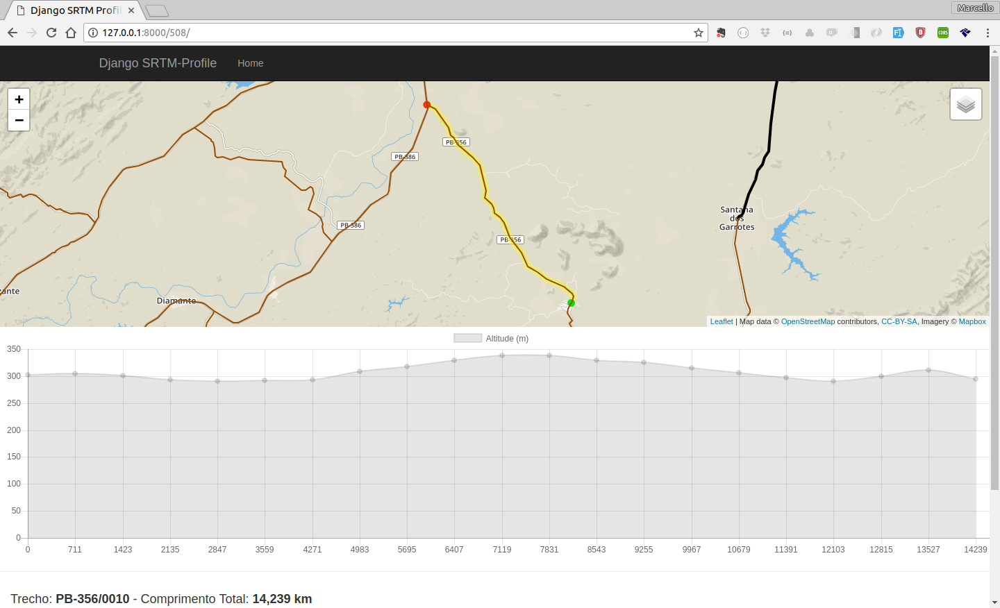

# Rio Verde do Mato Grosso - Relevo


## Descrição:

*relevo* é um projeto feito com GeoDjango e PostGIS que exemplifica a extração
de perfis topográficos de rodovias, através de dados de relevo [SRTM][1].




## Como Desenvolver?

* Clone o Repositório;
* Ative o virtualenv Python (>= 3.5);
* Instale as dependências;
* Crie um banco de dados espacial, utilizando o PostgreSQL e o PostGIS;
* Renomeie o `.env.sample` como `.env` e ajuste os parâmetros de conexão;
* Execute as migrações no banco de dados;
* Baixe os arquivos sql (roads.sql e dem.sql);
* Carregue os dados no banco.

```
git clone git@github.com:marcellobenigno/relevo.git
cd relevo
python -m venv .venv
source .venv/bin/activate
pip install -r requirements.txt
createdb relevo
psql relevo
create extension postgis;
\d
mv .env.sample .env
python manage.py makemigrations
python manage.py migrate
wget https://www.dropbox.com/s/a8q7e4dp5uv18c7/dem.sql
wget https://www.dropbox.com/s/eutiuk5w173ikz4/roads.sql
psql -f dem.sql -d relevo
psql -f roads.sql -d relevo
python manage.py runserver

```

[1]:https://www2.jpl.nasa.gov/srtm/
